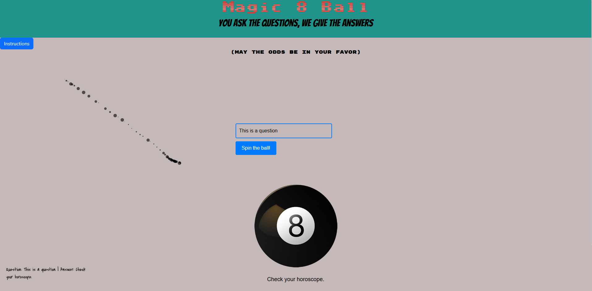

# Magic 8-Ball 

## Overview
The Magic 8-Ball Application is an interactive web-based app that mimics the experience of asking the classic Magic 8-Ball for answers. Users can ask any question, and the app will provide a random response along with changing themes and an image to match the response's tone. Additionally, the app stores a history of asked questions and answers using local storage.

## Features
Randomized Answers: Users receive a randomized answer to their question, such as "Yes," "No," or neutral responses.

Dynamic Theme Changes: The background color, header, and image change based on the type of response (positive, neutral, or negative).

Local Storage: The app stores a history of all questions asked and their corresponding answers, which can be viewed at the bottom of the page.

## Installation :

This is a static website. No installation is required beyond just cloning the repository.

## Future Enhancements 

Additional Responses: Expanding the answer pool for more variety.

Custom Themes: Allowing users to select or create their own themes.

Mobile Enhancements: Further optimization for mobile devices, improving user experience on small screens.

Voice Input: Enabling users to ask questions via voice commands.

## Contributors

Michael F.: Overall project contributions (Random answer generation functionality, CSS framework integration.)

Kane E.: Overall project contributions (Local storage integration and history display, CSS framework integration.)

Rani: Overall project contributions (Core functionality implementation and event handling, UI enhancements,.)

Michele Ferrario: Overall project contributions (theme changes ,UI enhancements, CSS framework integration.)

## Scrrenshot

## link

https://ilpacoog.github.io/magic-eightball/